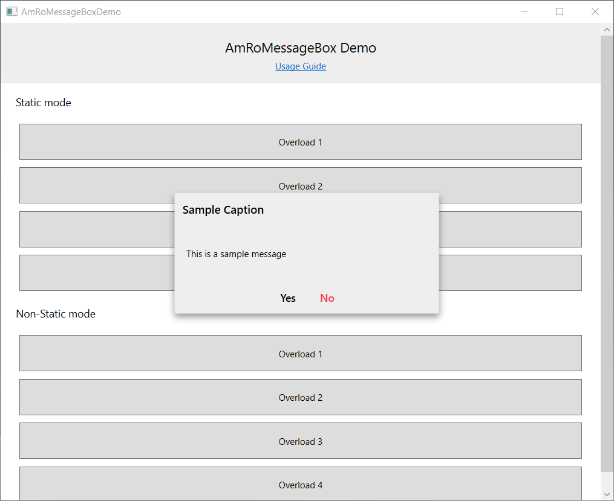
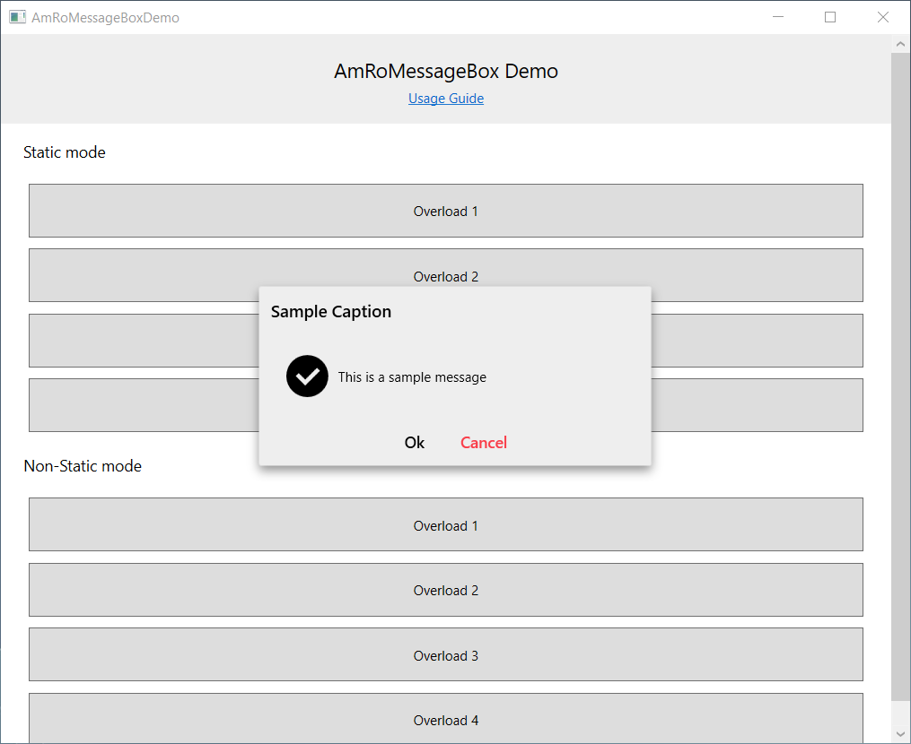
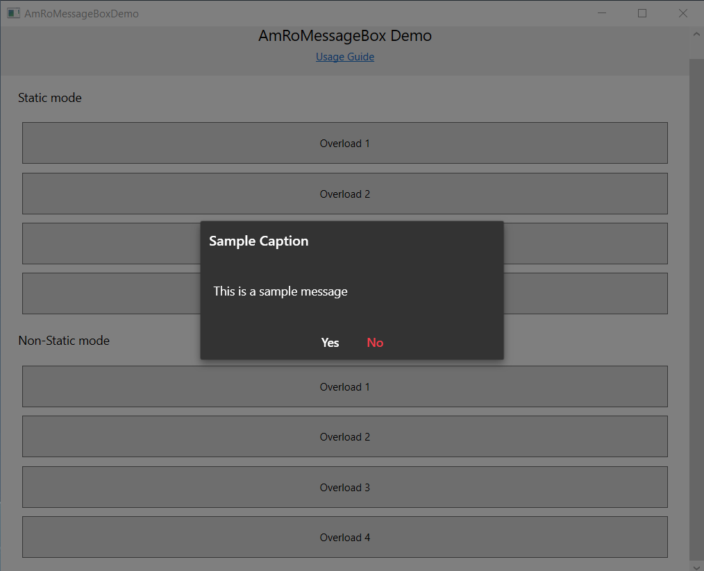
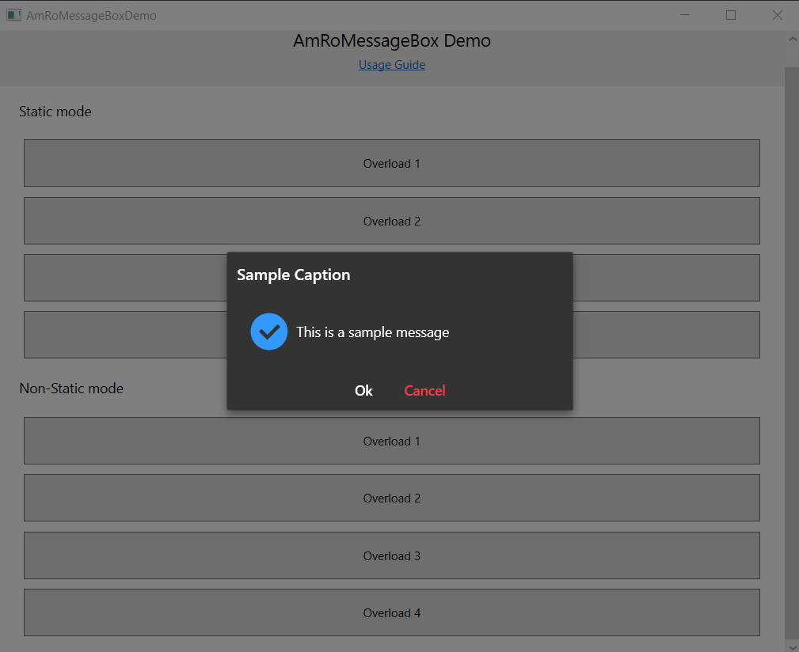

# AmRoMessageBox Component For WPF

<ul>
    <li><a href="#introduction">Introduction</a>
    <li><a href="#amromessagebox-features">Features</a>
    <li><a href="#installation-guide">Installation</a>
    <li><a href="#usage-guide">Usage</a>
    <li><a href="#overloads">Overloads</a>
    <li><a href="#parameters">Parameters</a>
    <li><a href="#properties">Properties</a>
    <li><a href="#screenshots">Screenshots</a>
    <li><a href="#persian-references">Useful References</a>
</ul>

## Introduction
The AmRoMessageBox is similar to the default MessageBox component, except that new features have been added. This component is also compatible with RTL languages and can be used to display RTL languages messages as well. The framework version of this component is 4.5 and is designed with Material Design method.

## AmRoMessageBox features
*	Includes four primary buttons (Yes, No, Ok and Cancel)
*	Ability to change the font size of the title and message text
*	Ability to change the color of different parts (such as background, message text, icons and buttons).
*	Ability to set effects for when the MessageBox is displayed
*	Ability to set custom text for buttons
*	Ability to set icons for MessageBox
*	Compatible with RTL and LTR languages
*	Beautiful and user-friendly appearance


## Installation Guide
To use this component, you must first add dlls to your project Reference section, and then you can use the AmRoMessageBox class in the AmRoMessageDialog namespace. To install this component via NuGet Package Manager, you can use the following command:
```
Install-Package AmRoMessageBox
```
Or download it from the link below and add it manually to the project Reference section:
<div><a href="https://www.nuget.org/packages/AmRoMessageBox">Download AmRoMessageBox From NuGet</a></div>

## Usage Guide
You can use the AmRoMessageBox component in two following method:
*	Static
*	Non-Static

#### Static Method
In this Method, as in the normal MessageBox, you can access the **ShowDialog()** method by writing the name of the class and displaying your messages using it. The static method has some limitations compared to the non-static method. There is no way to change the button text, change colors, change the font size, and set the effect for the MessageBox.

#### Example
The following example shows how to use the AmRoMessageBox class as static:
```C#
AmRoMessageBox.ShowDialog("Your Message ... ");
```
#### Non-static method
In this way, you can create an instance of the AmRoMessageBox class and apply your own properties to it.

#### Example
The following example shows how to use the AmRoMessageBox class as non-static:
```C#
var messageBox = new AmRoMessageBox
{
    Background = "#333333",
    TextColor = "#ffffff",
    IconColor = "#3399ff",
    RippleEffectColor = "#000000",
    ClickEffectColor = "#1F2023",
    ShowMessageWithEffect = true,
    EffectArea = this,
    ParentWindow = this
};
messageBox.Show("Your Message ..."); 
```
## Overloads
The ShowDialog() method, which is static, has five overloads that you can see below:
*	ShowDialog(string message, bool reverseContentDirection = false)
*	ShowDialog(string message, string caption, bool reverseContentDirection = false)
*	ShowDialog(string message, string caption, AmRoMessageBoxButton messageBoxButton, bool reverseContentDirection = false)
*	ShowDialog(string message, string caption, AmRoMessageBoxButton messageBoxButton, AmRoMessageBoxIcon messageBoxIcon, bool reverseContentDirection = false)
*	ShowDialog(string message, string caption, AmRoMessageBoxButton messageBoxButton, AmRoMessageBoxIcon messageBoxIcon, FlowDirection dircetion, bool reverseContentDirection = false)

**Note!** The overloads of the **Show()** method which used in non-static mode are similar to the overloads of the **ShowDialog()** method, except that the parameter does not have the *direction*.

## Parameters
Parameters description:
* message: Specifies the content of the message.
* caption: Specifies the title of the message.
* messageBoxButton: Specifies the MessageBox buttons (Ok, OkCancel, YesNo and YesNoCancel).
* messageBoxIcon: Specifies the MessageBox icon (None, Warring, Error, and Success).
* direction: Specifies the MessageBox direction (RTL or LTR).
* reverseContentDirection: changes the text direction of the message. That is, if RTL is converted to LTR and vice versa.

## Properties
In the following table, you can see the AmRoMessageBox class properties:

| Property  | Type | Description | 
| ------------- | ------------- | ------------- |
| Background | string | Specifies the background color |
| TextColor | string | Specifies the text color |
| IconColor | string | Specifies the icon color |
| WindowEffectColor | string | Specifies the window effect color |
| EffectArea | object | Specifies display region of window effect |
| RippleEffectColor | string | Specifies the buttons Ripple effect color |
| ClickEffectColor | string | Specifies the buttons Click effect color |
| FontFamily | FontFamily | Specifies the MessageBox font |
| EffectOpacity | double | Specifies the transparency level of window effect |
| MessageFontSize | double | Specifies message content font size |
| CaptionFontSize | double | Specifies message caption font size |
| Direction | FlowDirection | Specifies the MessageBox direction |
| ButtonsText | AmRoMessageBoxButtonsText | Specifies the MessageBox buttons text |
| ParentWindow | Window | Specifies the owner window |
| ShowMessageWithEffect | bool | Specifies whether MessageBox has an window effect when displaying or not |

## Screenshots





## Persian References
<div>
    <ul dir="rtl">
        <li dir="rtl"><a href="https://sourcesara.com/messagebox-component-for-wpf/">آموزش نصب و استفاده از کامپوننت AmRoMessageBox</a></li>
        <li dir="rtl"><a href="https://sourcesara.com/wpf-tutorial-video-in-csharp-from-elementary-to-advanced/">فیلم آموزش WPF در سی شارپ</a></li>
        <li dir="rtl"><a href="https://sourcesara.com/">آموزش برنامه نویسی</a></li>
    </ul>
</div>
